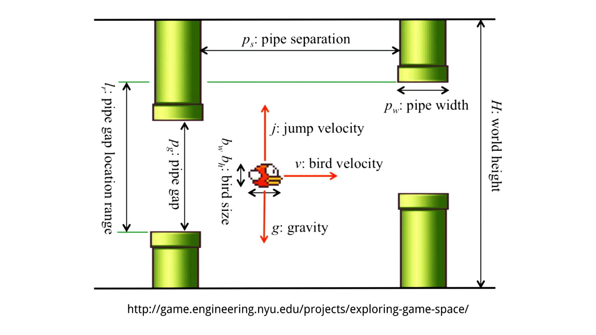

# bird-4: The anti-gravity update

`Main.lua`

```Lua
function love.load()
    -- ...
    -- Create own key
    love.keyboard.keysPressed = {}
end

function love.keypressed(key, scancode, isrepeat)
    love.keyboard.keysPressed[key] = true
    -- ...
end

function love.keyboard.wasPressed(key)
    return love.keyboard.keysPressed[key]
end

-- Reset table after each call to love.update
function love.update(dt)
    -- ...
    love.keyboard.keysPressed = {}
end
```

`Bird.lua`

```Lua
local ANTI_GRAVITY = -5

function Bird:update(dt)
    self.dy = self.dy + (GRAVITY * dt)
    if love.keyboard.wasPressed('space') then
        self.dy = ANTI_GRAVITY
    end
    self.y = self.y + self.dy
end
```

# References



http://game.engineering.nyu.edu/projects/exploring-game-space/
